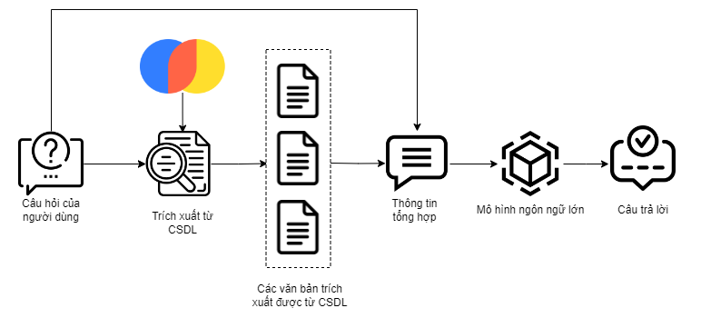

# Service để lấy các điều trong đề mục và đưa ra câu trả lời

Đây sẽ là hướng dẫn để giúp bạn khởi chạy Service nằm trong thư mục `/rag/`.

## Các chức năng của Service 
- Nhúng các văn bản pháp luật thành các Véc-tơ và lưu trữ chúng vào một CSDL:
    - Sử dụng mô hình Sentence - Transformers để nhúng các văn bản pháp luật từ HuggingFace🤗.
    - Sử dụng ChromaDB để lưu trữ các véc-tơ từ các văn bản pháp luật đã được nhúng.
- Sinh câu trả lời từ câu hỏi của người dùng và các văn bản pháp luật có liên quan được trích xuất hoặc được chỉ định:
    - Dựa vào câu hỏi và tình huống của người dùng, trích xuất các thông tin liên quan từ ChromaDB.
    - Kết hợp câu hỏi của người dùng và các văn bản pháp luật được trích xuất  hoặc được chỉ định thành một thông tin tổng hợp.
    - Đưa thông tin tổng hợp vào một mô hình ngôn ngữ lớn để có thể hiểu và đưa ra câu trả lời cho ngươi dùng.


## Hệ thống lưu trữ các văn bản Pháp luật
Thiết kế Hệ thống lưu trữ các văn bản Pháp luật như hình vẽ bên dưới:


## Hệ thống hỏi đáp
Thiết kế Hệ thống hỏi đáp như hình vẽ bên dưới:


### Cài đặt các thư viện cần thiết
Để cài đặt các thư viện cần thiết, hãy chạy câu lệnh bên dưới:
```bash
pip install -r requirements.txt
```

### Hướng dẫn khởi chạy service Hỏi đáp

1. **Chỉ định các mô hình Vector hóa dữ liệu**
Chỉ định mô hình `Sentence-Transformers` từ HuggingFace🤗.
Thêm tên mô hình hoặc địa chỉ vào `ST_MODEL_PATH` trong tập tin `.ENV`.

2. **Chỉ định các mô hình sinh câu trả lời**
Chỉ định mô hình có thể sinh câu trả lời từ HuggingFace🤗. Ví dụ như: BERTforQuestionAnswering, T5, Chat-Llama2 hay PhoGPT
Thêm tên mô hình hoặc địa chỉ vào `QA_MODEL_PATH` trong tập tin `.ENV`.

3. **Thêm đường dẫn đến thư mục Cơ sở dữ liệu Vector**
Thêm địa chỉ đến Cơ sở dữ liệu Vector vào `TOPIC_DB_PATH` trong tập tin `.ENV`.

4. **Khởi động dịch vụ**
Khởi động dịch vụ với câu lệnh sau:

```bash
python app.py
```
hoặc
```bash
python3 app.py
```
### Hướng dẫn nhúng các văn bản pháp luật
Do cần đảm bảo tính chất toàn vẹn của các thông tin về pháp luật, các văn bản đầu vào nên được chia thành các khối theo điểm hoặc điều hoàn chỉnh lưu vào tập tin dạng `CSV`.
1. **Cấu hình các đường dẫn**
Trong tập tin `vectorize_corpus.py`
- Thêm tên mô hình hoặc địa chỉ mô hình `Sentence-Transformers` vào `ST_MODEL_PATH`.
- Thêm tên địa chỉ các văn bản gốc vào `DOCS_PATH`.
- Thêm tên địa chỉ để lưu trữ CSDL vào `DB_PERSIST_PATH`.
2. **Thực thi nhúng văn bản và lưu trữ vào CSDL**
Thực thi nhúng văn bản và lưu trữ vào CSDL với câu lệnh sau:
```bash
python vectorize_corpus.py
```
hoặc
```bash
python3 vectorize_corpus.py
```