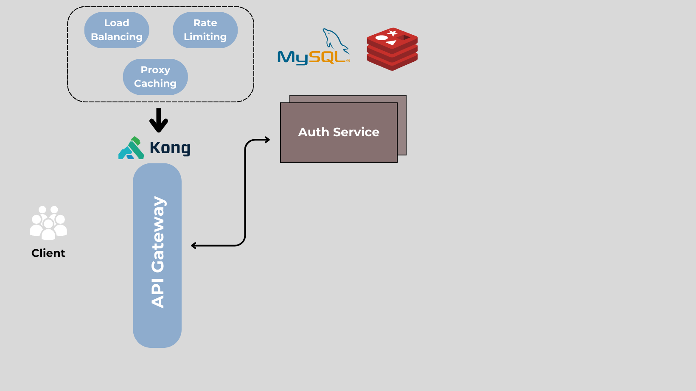

## Hệ thống

Thiết kế theo kiến trúc microservices như hình vẽ bên dưới:

### KONG API Gateway

-   Kong API Gateway: Sử dụng Kong API Gateway làm entrypoint cho hệ thống.
    -   Các request từ client sẽ được route đến các service tương ứng thông qua Kong.
    -   Sử dụng một Load Balancer Plugin để cân bằng tải giữa các services.
    -   Sử dụng Rate Limiting Plugin để giới hạn số request tối đa mà một client có thể gửi trong một khoảng thời gian nhất định.
    -   Sử dụng Proxy Cache Plugin để cache response từ các service.

### Auth Service

-   Auth Service: Service xử lý việc đăng nhập, đăng ký, đăng xuất, xác thực người dùng.
    -   Sử dụng JWT để phân quyền. Dùng access token và refresh token.
    -   Sử dụng Redis để lưu trữ refresh token.
    -   Sử dụng MySQL để lưu trữ thông tin người dùng.
